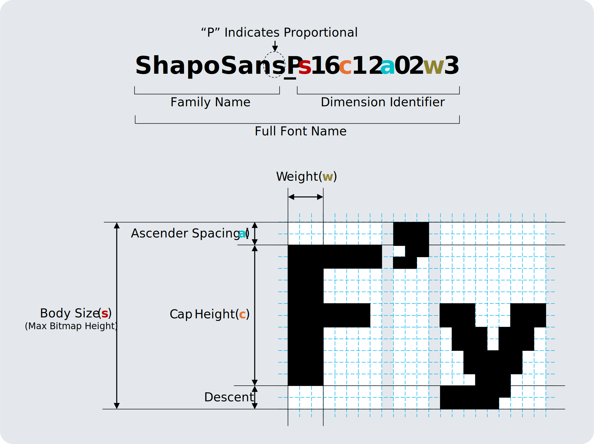

# ShapoFont

## Naming Rule



|Option|Description|Default Value|
|:--:|:--|:--:|
|s|typeSize|(required)|
|c|capHeight|s|
||descenderHeight|s - c|
|h|boxHeight|ceil(s \* 1.2)|
|a|ascenderSpacing|0|
||descenderSpacing|h-s-a|
|w|weight|1|
|p|horizontalSpacing|1 + floor(s / 12)|

## Memo: ASCII Code Table

```
      0   1   2   3   4   5   6   7   8   9   A   B   C   D   E   F
0x00  NUL SOH STX ETX EOT ENQ ACK BEL BS  HT  LF  VT  FF  CR  SO  SI
0x10  DLE DC1 DC2 DC3 DC4 NAK SYN ETB CAN EM  SUB ESC FS  GS  RS  US
0x20  SP  !   "   #   $   %   &   '   (   )   *   +   ,   -   .   /
0x30  0   1   2   3   4   5   6   7   8   9   :   ;   <   =   >   ?
0x40  @   A   B   C   D   E   F   G   H   I   J   K   L   M   N   O
0x50  P   Q   R   S   T   U   V   W   X   Y   Z   [   \   ]   ^   _
0x60  `   a   b   c   d   e   f   g   h   i   j   k   l   m   n   o
0x70  p   q   r   s   t   u   v   w   x   y   z   {   |   }   ~   DEL
0x80
0x90
0xA0      ｡   ｢   ｣   ､   ･   ｦ   ｧ   ｨ   ｩ   ｪ   ｫ   ｬ   ｭ   ｮ   ｯ
0xB0  ｰ   ｱ   ｲ   ｳ   ｴ   ｵ   ｶ   ｷ   ｸ   ｹ   ｺ   ｻ   ｼ   ｽ   ｾ   ｿ
0xC0  ﾀ   ﾁ   ﾂ   ﾃ   ﾄ   ﾅ   ﾆ   ﾇ   ﾈ   ﾉ   ﾊ   ﾋ   ﾌ   ﾍ   ﾎ   ﾏ
0xD0  ﾐ   ﾑ   ﾒ   ﾓ   ﾔ   ﾕ   ﾖ   ﾗ   ﾘ   ﾙ   ﾚ   ﾛ   ﾜ   ﾝ   ﾞ   ﾟ
0xE0
0xF0
```
