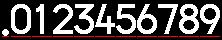
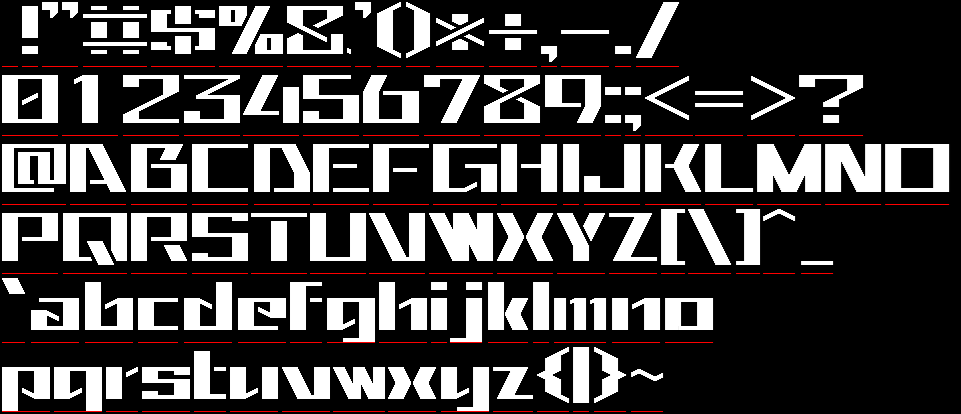

# ShapoFont

- Bitmap fonts made primarily for embedded projects
- a Tool for generating font files from PNG images

## Font Naming Rule


|Option|Description|Default Value|
|:--:|:--|:--:|
|s|typeSize|(required)|
|c|capHeight|s|
||descenderHeight|s - c|
|h|lineHeight|ceil(s \* 1.2)|
|a|ascenderSpacing|0|
||descenderSpacing|h-s-a|
|w|weight|1|
|p|horizontalSpacing|1 + floor(s / 12)|

## Fonts

### ShapoSansP

#### s05


#### s06c05a1


#### s08c07


#### s11c09w2a1


#### s20c16w3a1


#### s26c22w4a1


### ShapoSansMono

#### s08c07


### ShapoSansDigitP

#### s16c14w2


#### s24c23w4


#### s32c30w4



### MameSansP

#### s48c40w08


### MameSquareWide

#### s60c48w16a4



### MameSansDigitP

#### s64w08


### MameSeg7

#### s40c38w06


## Designing Font with Painting Tool

ShapoFonts are designed using Microsoft Paint and converted to some font formats by Python scripts.


### How to Design

1. Create a canvas of appropriate size with a black background.
2. Design your glyphs in white.
3. Draw a red line (**position marker**) of the same width at the bottom of each glyph.

    

4. Save the image as `design.png`.
5. In a JSON5 file `shapofont.json5`, list the characters contained in the image.

    ```json5
    {
        "codes": [
            {"from": 0x20, "to": 0x7E},
        ]
    }
    ```

- The vertical positions of the position markers of the glyphs side by side must be aligned.
- There must be at least typeSize + ascenderSpacing pixels of space above the position marker.
- The order of characters in the image must exactly match the order of characters listed in the meta information.

### Directory Structure

Create a directory for each dimension identifier under the family name directory and place a design image and meta information in it.

```
ShapoSansP/  .................. Family Name
+-- s20c16w3a1/  ............. Dimension Identifier
    +-- design.png  ......... Font Design File
    +-- shapofont.json5  .... Meta Information
```

### Converting to Font Files

1. Create a Python virtual environment using `venv-setup.shrc`.
    - `Pillow` and `json5` will be installed.
2. Specify the above design directory in `tools/shapofont.py` to convert to each font format.
    - `-i`: path to input directory (dimension identifier)
    - `--outdir_gfx`: output directory for GFXfont format

Since the script extracts a family name and a dimension identifier from the directory path, they must be named correctly.

#### Example:

```bash
source venv-setup.shrc
./venv/bin/python3 ./tools/shapofont.py \
      -i bitmap/ShapoSansP/s20c16w3a1 \
      --outdir_gfx tmp.outdir/
```

In this repository, after creating the venv, simply run `make all` and all fonts will be converted automatically.

## License

see [LICENSE](LICENSE).

The rights to font files generated using the tools included in ShapoFont are subject to the rights of the original bitmap images and any fonts contained therein.

## Using GFXfont in LovyanGFX

Before including the generated GFXfont, define the `SHAPOFONT_GFXFONT_NAMESPACE=::lgfx::` macro so that it can be used with LovyanGFX.

```c++
#pragma once

#define SHAPOFONT_GFXFONT_NAMESPACE ::lgfx::
#include "shapofont/ShapoSansP_s11c09w2a1.h"
```

## Memo: ASCII Code Table

```
      0   1   2   3   4   5   6   7   8   9   A   B   C   D   E   F
0x00  NUL SOH STX ETX EOT ENQ ACK BEL BS  HT  LF  VT  FF  CR  SO  SI
0x10  DLE DC1 DC2 DC3 DC4 NAK SYN ETB CAN EM  SUB ESC FS  GS  RS  US
0x20  SP  !   "   #   $   %   &   '   (   )   *   +   ,   -   .   /
0x30  0   1   2   3   4   5   6   7   8   9   :   ;   <   =   >   ?
0x40  @   A   B   C   D   E   F   G   H   I   J   K   L   M   N   O
0x50  P   Q   R   S   T   U   V   W   X   Y   Z   [   \   ]   ^   _
0x60  `   a   b   c   d   e   f   g   h   i   j   k   l   m   n   o
0x70  p   q   r   s   t   u   v   w   x   y   z   {   |   }   ~   DEL
0x80
0x90
0xA0      ｡   ｢   ｣   ､   ･   ｦ   ｧ   ｨ   ｩ   ｪ   ｫ   ｬ   ｭ   ｮ   ｯ
0xB0  ｰ   ｱ   ｲ   ｳ   ｴ   ｵ   ｶ   ｷ   ｸ   ｹ   ｺ   ｻ   ｼ   ｽ   ｾ   ｿ
0xC0  ﾀ   ﾁ   ﾂ   ﾃ   ﾄ   ﾅ   ﾆ   ﾇ   ﾈ   ﾉ   ﾊ   ﾋ   ﾌ   ﾍ   ﾎ   ﾏ
0xD0  ﾐ   ﾑ   ﾒ   ﾓ   ﾔ   ﾕ   ﾖ   ﾗ   ﾘ   ﾙ   ﾚ   ﾛ   ﾜ   ﾝ   ﾞ   ﾟ
0xE0
0xF0
```
