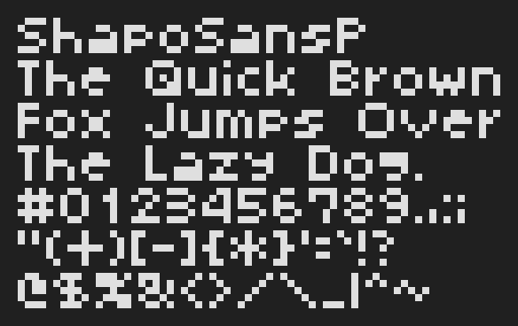
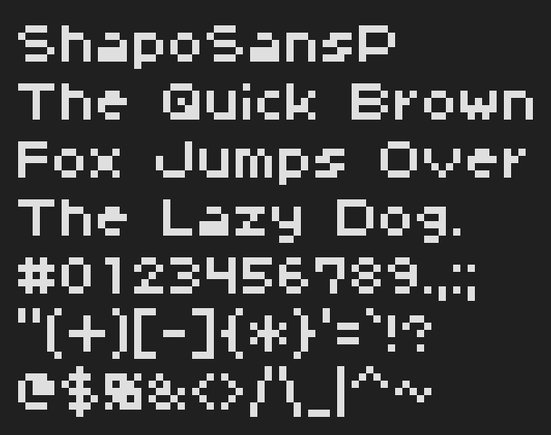
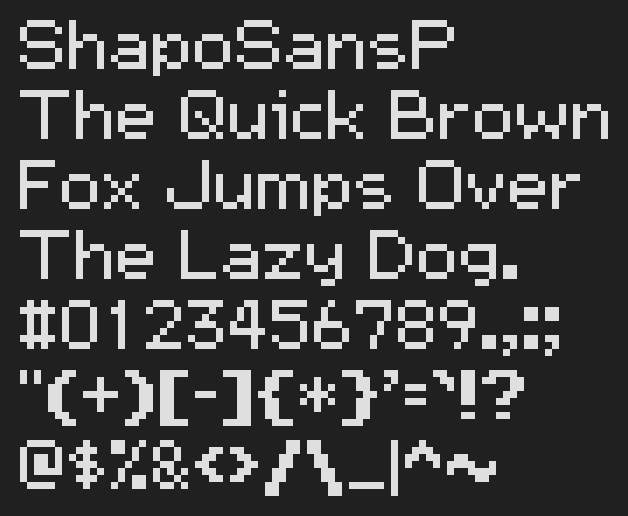
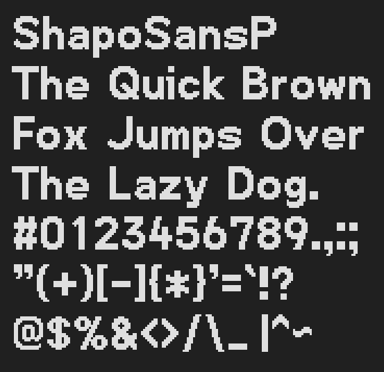
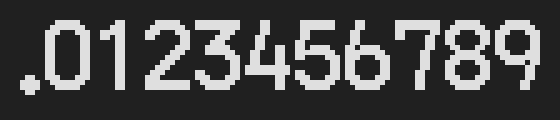
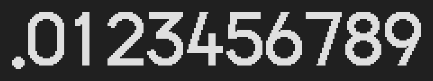
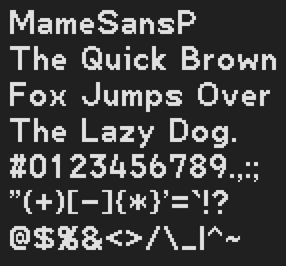
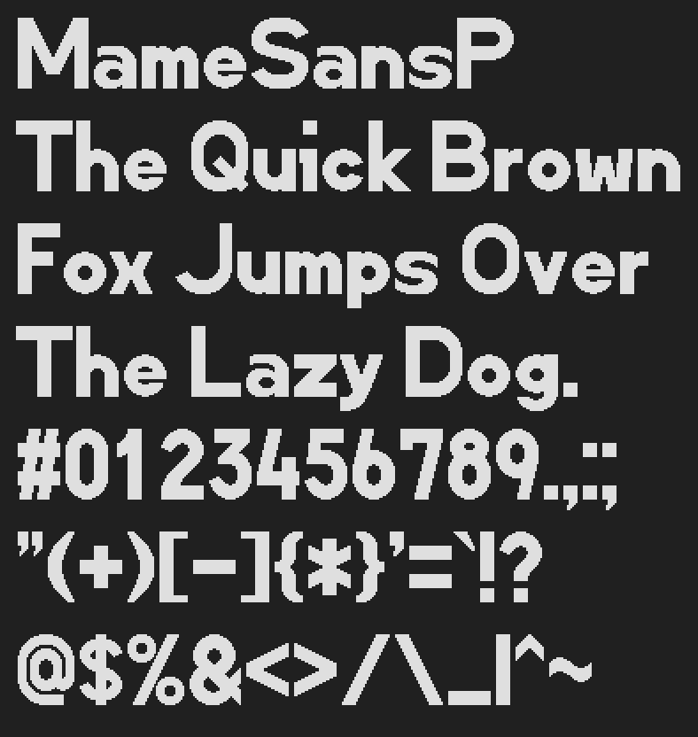
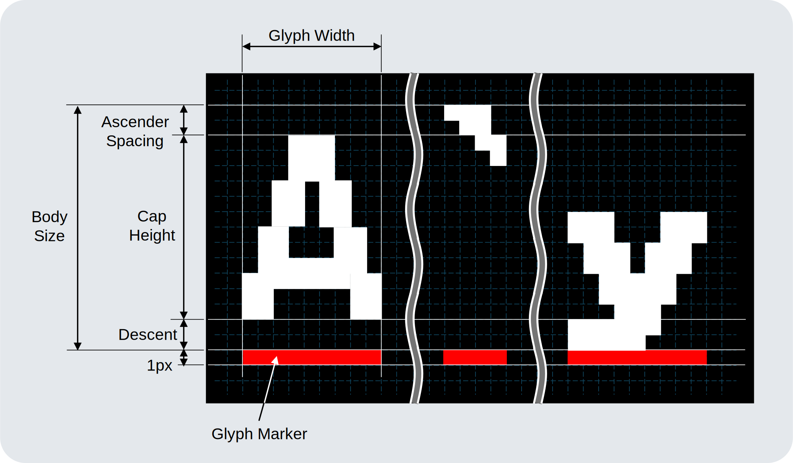
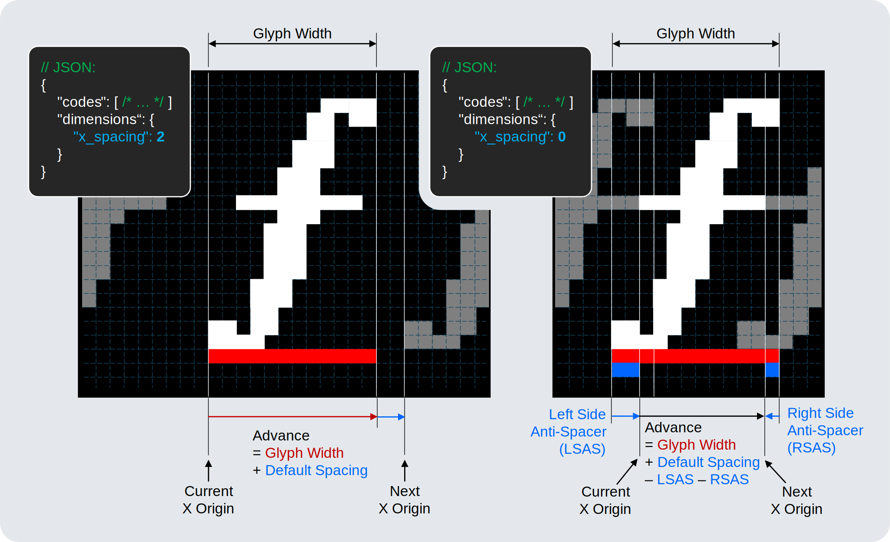

<p align="center"></p>
<h1 align="center">ShapoFont</h1>
<p align="center">シャポフォント</p>
<p align="center"></p>

- Bitmap fonts for embedded projects<br>
    組み込み向けビットマップフォント
- Tools for generating GFXfont from PNG images<br>
    「ペイント」などでデザインしたフォントから GFXfont を生成するツール

# Font Catalog

Click thumbnail to open the font with [GFXfont Web Simulator](https://shapoco.github.io/shapofont/sim/).<br>
サムネイルをクリックすると[ブラウザ上のシミュレータ](https://shapoco.github.io/shapofont/sim/)でお試しできます。

<!-- SHAPOFONT_START_OF_FONT_CATALOG -->

## ShapoSansP

Proportional fonts for embedded projects

|Sample|Downloads (Footprint)|
|:--|:--|
|<a href="https://shapoco.github.io/shapofont/sim/#u=/shapofont/ShapoSansP_s05.h" target="_blank"></a>|**s05**<br>[GFXfont](gfxfont/cpp/include/ShapoSansP_s05.h) (985 B)<br>[MameFont-HL](mamefont/cpp/HL/include/ShapoSansP_s05.hpp) (579 B)<br>[MameFont-HM](mamefont/cpp/HM/include/ShapoSansP_s05.hpp) (577 B)<br>[MameFont-VL](mamefont/cpp/VL/include/ShapoSansP_s05.hpp) (519 B)<br>[MameFont-VM](mamefont/cpp/VM/include/ShapoSansP_s05.hpp) (515 B)|
|<a href="https://shapoco.github.io/shapofont/sim/#u=/shapofont/ShapoSansP_s07c05a01.h" target="_blank"></a>|**s07c05a01**<br>[GFXfont](gfxfont/cpp/include/ShapoSansP_s07c05a01.h) (1021 B)<br>[MameFont-HL](mamefont/cpp/HL/include/ShapoSansP_s07c05a01.hpp) (675 B)<br>[MameFont-HM](mamefont/cpp/HM/include/ShapoSansP_s07c05a01.hpp) (679 B)<br>[MameFont-VL](mamefont/cpp/VL/include/ShapoSansP_s07c05a01.hpp) (537 B)<br>[MameFont-VM](mamefont/cpp/VM/include/ShapoSansP_s07c05a01.hpp) (537 B)|
|<a href="https://shapoco.github.io/shapofont/sim/#u=/shapofont/ShapoSansP_s08c07.h" target="_blank"></a>|**s08c07**<br>[GFXfont](gfxfont/cpp/include/ShapoSansP_s08c07.h) (1.15 kB)<br>[MameFont-HL](mamefont/cpp/HL/include/ShapoSansP_s08c07.hpp) (751 B)<br>[MameFont-HM](mamefont/cpp/HM/include/ShapoSansP_s08c07.hpp) (757 B)<br>[MameFont-VL](mamefont/cpp/VL/include/ShapoSansP_s08c07.hpp) (648 B)<br>[MameFont-VM](mamefont/cpp/VM/include/ShapoSansP_s08c07.hpp) (648 B)|
|<a href="https://shapoco.github.io/shapofont/sim/#u=/shapofont/ShapoSansP_s12c09a01w02.h" target="_blank"></a>|**s12c09a01w02**<br>[GFXfont](gfxfont/cpp/include/ShapoSansP_s12c09a01w02.h) (1.32 kB)<br>[MameFont-HL](mamefont/cpp/HL/include/ShapoSansP_s12c09a01w02.hpp) (1.02 kB)<br>[MameFont-HM](mamefont/cpp/HM/include/ShapoSansP_s12c09a01w02.hpp) (1.03 kB)<br>[MameFont-VL](mamefont/cpp/VL/include/ShapoSansP_s12c09a01w02.hpp) (1.08 kB)<br>[MameFont-VM](mamefont/cpp/VM/include/ShapoSansP_s12c09a01w02.hpp) (1.08 kB)|
|<a href="https://shapoco.github.io/shapofont/sim/#u=/shapofont/ShapoSansP_s21c16a01w03.h" target="_blank"></a>|**s21c16a01w03**<br>[GFXfont](gfxfont/cpp/include/ShapoSansP_s21c16a01w03.h) (2.37 kB)<br>[MameFont-HL](mamefont/cpp/HL/include/ShapoSansP_s21c16a01w03.hpp) (1.65 kB)<br>[MameFont-HM](mamefont/cpp/HM/include/ShapoSansP_s21c16a01w03.hpp) (1.65 kB)<br>[MameFont-VL](mamefont/cpp/VL/include/ShapoSansP_s21c16a01w03.hpp) (1.71 kB)<br>[MameFont-VM](mamefont/cpp/VM/include/ShapoSansP_s21c16a01w03.hpp) (1.71 kB)|
|<a href="https://shapoco.github.io/shapofont/sim/#u=/shapofont/ShapoSansP_s27c22a01w04.h" target="_blank"></a>|**s27c22a01w04**<br>[GFXfont](gfxfont/cpp/include/ShapoSansP_s27c22a01w04.h) (3.67 kB)<br>[MameFont-HL](mamefont/cpp/HL/include/ShapoSansP_s27c22a01w04.hpp) (1.96 kB)<br>[MameFont-HM](mamefont/cpp/HM/include/ShapoSansP_s27c22a01w04.hpp) (1.97 kB)<br>[MameFont-VL](mamefont/cpp/VL/include/ShapoSansP_s27c22a01w04.hpp) (1.92 kB)<br>[MameFont-VM](mamefont/cpp/VM/include/ShapoSansP_s27c22a01w04.hpp) (1.92 kB)|


## ShapoSansDigitP

Proportional number fonts for embedded projects

|Sample|Downloads (Footprint)|
|:--|:--|
|<a href="https://shapoco.github.io/shapofont/sim/#u=/shapofont/ShapoSansDigitP_s16c14w02.h" target="_blank"></a>|**s16c14w02**<br>[GFXfont](gfxfont/cpp/include/ShapoSansDigitP_s16c14w02.h) (261 B)<br>[MameFont-HL](mamefont/cpp/HL/include/ShapoSansDigitP_s16c14w02.hpp) (178 B)<br>[MameFont-HM](mamefont/cpp/HM/include/ShapoSansDigitP_s16c14w02.hpp) (178 B)<br>[MameFont-VL](mamefont/cpp/VL/include/ShapoSansDigitP_s16c14w02.hpp) (193 B)<br>[MameFont-VM](mamefont/cpp/VM/include/ShapoSansDigitP_s16c14w02.hpp) (193 B)|
|<a href="https://shapoco.github.io/shapofont/sim/#u=/shapofont/ShapoSansDigitP_s24c23w04.h" target="_blank"></a>|**s24c23w04**<br>[GFXfont](gfxfont/cpp/include/ShapoSansDigitP_s24c23w04.h) (547 B)<br>[MameFont-HL](mamefont/cpp/HL/include/ShapoSansDigitP_s24c23w04.hpp) (283 B)<br>[MameFont-HM](mamefont/cpp/HM/include/ShapoSansDigitP_s24c23w04.hpp) (282 B)<br>[MameFont-VL](mamefont/cpp/VL/include/ShapoSansDigitP_s24c23w04.hpp) (291 B)<br>[MameFont-VM](mamefont/cpp/VM/include/ShapoSansDigitP_s24c23w04.hpp) (291 B)|
|<a href="https://shapoco.github.io/shapofont/sim/#u=/shapofont/ShapoSansDigitP_s32c30w04.h" target="_blank"></a>|**s32c30w04**<br>[GFXfont](gfxfont/cpp/include/ShapoSansDigitP_s32c30w04.h) (818 B)<br>[MameFont-HL](mamefont/cpp/HL/include/ShapoSansDigitP_s32c30w04.hpp) (376 B)<br>[MameFont-HM](mamefont/cpp/HM/include/ShapoSansDigitP_s32c30w04.hpp) (375 B)<br>[MameFont-VL](mamefont/cpp/VL/include/ShapoSansDigitP_s32c30w04.hpp) (369 B)<br>[MameFont-VM](mamefont/cpp/VM/include/ShapoSansDigitP_s32c30w04.hpp) (369 B)|


## ShapoSansMono

Monospaced fonts for embedded projects

|Sample|Downloads (Footprint)|
|:--|:--|
|<a href="https://shapoco.github.io/shapofont/sim/#u=/shapofont/ShapoSansMono_s08c07.h" target="_blank"></a>|**s08c07**<br>[GFXfont](gfxfont/cpp/include/ShapoSansMono_s08c07.h) (1.12 kB)<br>[MameFont-HL](mamefont/cpp/HL/include/ShapoSansMono_s08c07.hpp) (639 B)<br>[MameFont-HM](mamefont/cpp/HM/include/ShapoSansMono_s08c07.hpp) (643 B)<br>[MameFont-VL](mamefont/cpp/VL/include/ShapoSansMono_s08c07.hpp) (593 B)<br>[MameFont-VM](mamefont/cpp/VM/include/ShapoSansMono_s08c07.hpp) (593 B)|


## MameSansP

Proportional fonts optimized for compression with MameFont

|Sample|Downloads (Footprint)|
|:--|:--|
|<a href="https://shapoco.github.io/shapofont/sim/#u=/shapofont/MameSansP_s15c12w02.h" target="_blank"></a>|**s15c12w02**<br>[GFXfont](gfxfont/cpp/include/MameSansP_s15c12w02.h) (1.63 kB)<br>[MameFont-HL](mamefont/cpp/HL/include/MameSansP_s15c12w02.hpp) (1.18 kB)<br>[MameFont-HM](mamefont/cpp/HM/include/MameSansP_s15c12w02.hpp) (1.18 kB)<br>[MameFont-VL](mamefont/cpp/VL/include/MameSansP_s15c12w02.hpp) (1.23 kB)<br>[MameFont-VM](mamefont/cpp/VM/include/MameSansP_s15c12w02.hpp) (1.23 kB)|
|<br>(Simulator not available)|**s15c12w02g02**<br>(GFXfont not available)<br>[MameFont-HL](mamefont/cpp/HL/include/MameSansP_s15c12w02g02.hpp) (1.59 kB)<br>[MameFont-HM](mamefont/cpp/HM/include/MameSansP_s15c12w02g02.hpp) (1.59 kB)<br>[MameFont-VL](mamefont/cpp/VL/include/MameSansP_s15c12w02g02.hpp) (1.62 kB)<br>[MameFont-VM](mamefont/cpp/VM/include/MameSansP_s15c12w02g02.hpp) (1.62 kB)|
|<a href="https://shapoco.github.io/shapofont/sim/#u=/shapofont/MameSansP_s48c40w08.h" target="_blank"></a>|**s48c40w08**<br>[GFXfont](gfxfont/cpp/include/MameSansP_s48c40w08.h) (9.89 kB)<br>[MameFont-HL](mamefont/cpp/HL/include/MameSansP_s48c40w08.hpp) (2.52 kB)<br>[MameFont-HM](mamefont/cpp/HM/include/MameSansP_s48c40w08.hpp) (2.52 kB)<br>[MameFont-VL](mamefont/cpp/VL/include/MameSansP_s48c40w08.hpp) (2.58 kB)<br>[MameFont-VM](mamefont/cpp/VM/include/MameSansP_s48c40w08.hpp) (2.58 kB)|


## MameSansDigitP

Proportional number fonts optimized for compression with MameFont

|Sample|Downloads (Footprint)|
|:--|:--|
|<a href="https://shapoco.github.io/shapofont/sim/#u=/shapofont/MameSansDigitP_s64w08.h" target="_blank"></a>|**s64w08**<br>[GFXfont](gfxfont/cpp/include/MameSansDigitP_s64w08.h) (3.05 kB)<br>[MameFont-HL](mamefont/cpp/HL/include/MameSansDigitP_s64w08.hpp) (537 B)<br>[MameFont-HM](mamefont/cpp/HM/include/MameSansDigitP_s64w08.hpp) (537 B)<br>[MameFont-VL](mamefont/cpp/VL/include/MameSansDigitP_s64w08.hpp) (510 B)<br>[MameFont-VM](mamefont/cpp/VM/include/MameSansDigitP_s64w08.hpp) (510 B)|


## MameSeg7

7-segment display fonts optimized for compression with MameFont

|Sample|Downloads (Footprint)|
|:--|:--|
|<br>(Simulator not available)|**s22c20w03g02**<br>(GFXfont not available)<br>[MameFont-HL](mamefont/cpp/HL/include/MameSeg7_s22c20w03g02.hpp) (624 B)<br>[MameFont-HM](mamefont/cpp/HM/include/MameSeg7_s22c20w03g02.hpp) (630 B)<br>[MameFont-VL](mamefont/cpp/VL/include/MameSeg7_s22c20w03g02.hpp) (583 B)<br>[MameFont-VM](mamefont/cpp/VM/include/MameSeg7_s22c20w03g02.hpp) (581 B)|
|<a href="https://shapoco.github.io/shapofont/sim/#u=/shapofont/MameSeg7_s40c38w06.h" target="_blank"></a>|**s40c38w06**<br>[GFXfont](gfxfont/cpp/include/MameSeg7_s40c38w06.h) (1.70 kB)<br>[MameFont-HL](mamefont/cpp/HL/include/MameSeg7_s40c38w06.hpp) (669 B)<br>[MameFont-HM](mamefont/cpp/HM/include/MameSeg7_s40c38w06.hpp) (673 B)<br>[MameFont-VL](mamefont/cpp/VL/include/MameSeg7_s40c38w06.hpp) (746 B)<br>[MameFont-VM](mamefont/cpp/VM/include/MameSeg7_s40c38w06.hpp) (746 B)|
|<br>(Simulator not available)|**s40c38w06g02**<br>(GFXfont not available)<br>[MameFont-HL](mamefont/cpp/HL/include/MameSeg7_s40c38w06g02.hpp) (919 B)<br>[MameFont-HM](mamefont/cpp/HM/include/MameSeg7_s40c38w06g02.hpp) (919 B)<br>[MameFont-VL](mamefont/cpp/VL/include/MameSeg7_s40c38w06g02.hpp) (968 B)<br>[MameFont-VM](mamefont/cpp/VM/include/MameSeg7_s40c38w06g02.hpp) (968 B)|


## MameSquareWide

Square wide fonts optimized for compression with MameFont

|Sample|Downloads (Footprint)|
|:--|:--|
|<a href="https://shapoco.github.io/shapofont/sim/#u=/shapofont/MameSquareWide_s64c48a04w16.h" target="_blank"></a>|**s64c48a04w16**<br>[GFXfont](gfxfont/cpp/include/MameSquareWide_s64c48a04w16.h) (21.88 kB)<br>[MameFont-HL](mamefont/cpp/HL/include/MameSquareWide_s64c48a04w16.hpp) (2.88 kB)<br>[MameFont-HM](mamefont/cpp/HM/include/MameSquareWide_s64c48a04w16.hpp) (2.88 kB)<br>[MameFont-VL](mamefont/cpp/VL/include/MameSquareWide_s64c48a04w16.hpp) (3.10 kB)<br>[MameFont-VM](mamefont/cpp/VM/include/MameSquareWide_s64c48a04w16.hpp) (3.10 kB)|

<!-- SHAPOFONT_END_OF_FONT_CATALOG -->

# Using GFXfont in LovyanGFX

Before including the generated GFXfont, define the `SHAPOFONT_GFXFONT_NAMESPACE=::lgfx::` macro so that it can be used with LovyanGFX.

```c++
#define SHAPOFONT_GFXFONT_NAMESPACE ::lgfx::
#include "shapofont/ShapoSansP_s11c09w2a1.h"
```

# Designing Font with Painting Tool

ShapoFonts are designed using painting tools such as Microsoft Paint and converted to GFXfont by Python scripts.<br>
ShapoFont は「ペイント」などのペイントソフトでデザインされ、Python スクリプトを使って GFXfont に変換されています。


## Requirements

- Painting Tool (I used mspaint)
- Linux environment with Python (I used WSL2)

## Naming Rule


|Option|Description|Default Value|
|:--:|:--|:--:|
|s|Body Size|(required)|
|c|Cap Height|s|
|a|Ascender Spacing|0|
||Descent|s - c - a|
|w|weight|1|

## How to Design Your Own Font

1. Create a canvas of appropriate size with a black background.
2. Design your glyphs in white.
3. Add a red line (**Glyph Marker**) of the same width at the bottom of each glyph.

    

4. Save the image as `design.png`.
5. In a JSON file `design.json`, list the characters contained in the image.

    ```json
    {
        "codes": [
            {
                "from": 32,
                "to": 126
            }
        ],
        "dimensions": {
            "body_size:": 12,
            "cap_height": 9,
            "ascender_spacing": 1,
            "weight": 2,
            "x_spacing": 1,
            "y_spacing": 5
        }
    }
    ```

    If `dimensions` are omitted, the script will try to extract the dimension values from the directory name of design file.

- The vertical positions of the glyph markers of the glyphs side by side must be aligned.
- There must be at least Body Size pixels of space above the glyph marker (no overlap).
- The order of characters in the image must exactly match the order of characters listed in the `design.json`.

### Spacing Adjustment

If only glyph marker (red line) is given in design image, when rendering it, the character's horizontal coordinate is advanced by the glyph width plus default spacing defined in JSON. If you want to adjust the spacing for each character, you can add blue lines.



The blue line just below the left edge of the glyph marker (Left Side Anti-Spacer, LSAS) decreases the spacing on the left side, and the blue line just below the right edge (Right Side Anti-Spacer, RSAS) decreases the spacing on the right side.

## Directory Structure

Create a directory with full font name and place a design image and meta information in it.

### Example:

```
ShapoSansP_s21c16a01w03/  ... Full Font Name
+-- design.png  ............. Font Design File
+-- design.json  ............ Meta Information
```

If `dimensions` is not specified in JSON, the generator script extracts a family name and a dimension identifier from the directory name, so they must be named correctly.

## Converting to GFXfont

1. Create a Python virtual environment using `venv-setup.shrc`.
    - `Pillow` and `json5` will be installed.
2. Specify the above design directory in `tools/shapofont.py` to convert to each font format.
    - `-i`: path to input directory (dimension identifier)
    - `--outdir_gfx_c`: output directory for GFXfont format

### Example:

```bash
source venv-setup.shrc
./venv/bin/python3 ./tools/shapofont.py \
      -i design/ShapoSansP_s21c16a01w03 \
      --outdir_gfx_c path/to/output/dir/
```

In this repository, after creating the venv, simply run `make -j gfx_all` and all fonts will be converted automatically.

# License

see [LICENSE](LICENSE).

The rights to font files generated using the tools included in ShapoFont are subject to the rights of the original bitmap images and any fonts contained therein.

# Related Project

## MameFont

See [MameFont](https://github.com/shapoco/mamefont).

# Memo

## ASCII (JIS X 0201) Code Table

```
      0   1   2   3   4   5   6   7   8   9   A   B   C   D   E   F
0x00  NUL SOH STX ETX EOT ENQ ACK BEL BS  HT  LF  VT  FF  CR  SO  SI
0x10  DLE DC1 DC2 DC3 DC4 NAK SYN ETB CAN EM  SUB ESC FS  GS  RS  US
0x20  SP  !   "   #   $   %   &   '   (   )   *   +   ,   -   .   /
0x30  0   1   2   3   4   5   6   7   8   9   :   ;   <   =   >   ?
0x40  @   A   B   C   D   E   F   G   H   I   J   K   L   M   N   O
0x50  P   Q   R   S   T   U   V   W   X   Y   Z   [   \   ]   ^   _
0x60  `   a   b   c   d   e   f   g   h   i   j   k   l   m   n   o
0x70  p   q   r   s   t   u   v   w   x   y   z   {   |   }   ~   DEL
0x80
0x90
0xA0      ｡   ｢   ｣   ､   ･   ｦ   ｧ   ｨ   ｩ   ｪ   ｫ   ｬ   ｭ   ｮ   ｯ
0xB0  ｰ   ｱ   ｲ   ｳ   ｴ   ｵ   ｶ   ｷ   ｸ   ｹ   ｺ   ｻ   ｼ   ｽ   ｾ   ｿ
0xC0  ﾀ   ﾁ   ﾂ   ﾃ   ﾄ   ﾅ   ﾆ   ﾇ   ﾈ   ﾉ   ﾊ   ﾋ   ﾌ   ﾍ   ﾎ   ﾏ
0xD0  ﾐ   ﾑ   ﾒ   ﾓ   ﾔ   ﾕ   ﾖ   ﾗ   ﾘ   ﾙ   ﾚ   ﾛ   ﾜ   ﾝ   ﾞ   ﾟ
0xE0
0xF0
```
