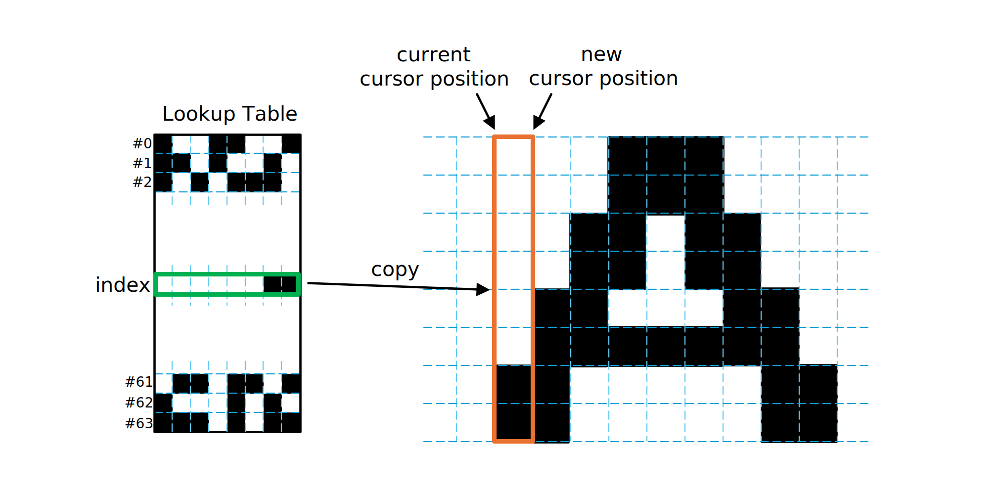

# [WIP] MameFont

Compressed font format definitions and tools for small-footprint embedded projects.

"Mame" (まめ, 豆) means "bean(s)" in Japanese.

# Flow


# Format Specification

## Blob Structure

|Size \[Bytes\]|Name|
|:--:|:--|
|8|Font Header|
|4 \* `glyphTableLen`|Character Table|
|`lutSize`|Byte Lookup Table (LUT)|
|(Variable)|Microcode Blocks|

## Font Header

A structure that provides information common to the entire font.

|Size \[Bytes\]|Name|Description|
|:--:|:--|:--|
|1|`formatVersion`|0x01|
|1|`firstCode`|ASCII code of the first entry of Glyph Table|
|1|`glyphTableLen`|Number of entries of Glyph Table|
|1|`lutSize`|Number of bytes of LUT|
|1|`fontDimension0`|Dimension of Font|
|1|`fontDimension1`|Dimension of Font|
|1|(Reserved)||
|1|`fontFlags`||

### `fontDimension0`

|Bit Range|Name|Description|
|:--:|:--|:--|
|7:6|(Reserved)||
|5:0|`fontHeight`|Height of glyph in pixels|

### `fontDimension1`

|Bit Range|Name|Description|
|:--:|:--|:--|
|7:6|(Reserved)||
|5:0|`yAdvance`|Vertical spacing in pixels|

### `fontFlags`

|Bit Range|Name|Description|
|:--:|:--|:--|
|7|`scanDirection`|0: horizontal, 1: vertical|
|6|`reverseBitOrder`|0: LSB=nearBit, 1: LSB=farBit|
|5:0|(Reserved)||


## Glyph Table Entry

|Size \[Bytes\]|Name|Description|
|:--:|:--|:--|
|2|`entryPoint`|Offset from start of Microcode Block in bytes|
|1|`glyphDimension0`|Dimension of glyph bitmap|
|2|`glyphDimension1`|Dimension of glyph bitmap|

### `glyphDimension0`

|Bit Range|Name|Description|
|:--:|:--|:--|
|7:6|(Reserved)||
|5:0|`glyphWidth`|Number of pixels of glyph bitmap|

### `glyphDimension1`

|Bit Range|Name|Description|
|:--:|:--|:--|
|7:6|(Reserved)||
|5:0|`xAdvance`|Horizontal spacing in pixels|

## Microcode Block

|Size \[Bytes\]|Description|
|:--:|:--|
|(Variable)|Array of instructions|

## Instruction Set

|Byte0|Byte1|Mnemonic|Description|
|:--:|:--:|:--:|:--|
|0x00-3F|-|`LKP`|Load from LUT|
|0x40-4F|-|`SLC`|Shift Left Previous Byte and Clear LSB|
|0x50-5F|-|`SLS`|Shift Left Previous Byte and Set LSB|
|0x60-6F|-|`SRC`|Shift Right Previous Byte and Clear MSB|
|0x70-7F|-|`SRS`|Shift Right Previous Byte and Set MSB|
|0x80|Byte Data|`LDI`|Load Immediate|
|0x81-9F|-|`BLK`|Block Lookup|
|0xA0||-|(Reserved)|
|0xA1-BF|-|`CPY`|Copy Previous Sequence|
|0xC0||-|(Reserved)|
|0xC1-C7|-|`REV`|Reverse Previous Sequence|
|0xC8||-|(Reserved)|
|0xC9-CF|-|`REV`|Reverse Previous Sequence|
|0xD0||-|(Reserved)|
|0xD1-D7|-|`REV`|Reverse Previous Sequence|
|0xD8||-|(Reserved)|
|0xD9-DF|-|`REV`|Reverse Previous Sequence|
|0xE0-EF|-|`RPT`|Repeat Previous Byte|
|0xF0-FE|-|`XOR`|XOR Previous Byte and Immediate|
|0xff||-|(Reserved)|

### Lookup (`LKP`)

|Byte|Bit Range|Value|
|:--:|:--:|:--|
|1st.|7:6|0b00|
||5:0|`index`|

The state machine simply copies the byte in the LUT to the glyph buffer. If reverseBitOrder=1 is set, the byte data in the LUT must also have its bit order reversed.

```c
buff[cursor++] = lut[index];
```



### Block Lookup (`BLK`)

|Byte|Bit Range|Value|
|:--:|:--:|:--|
|1st.|7:6|0b00|
||5:0|`index`|

The state machine simply copies the byte in the LUT to the glyph buffer. If reverseBitOrder=1 is set, the byte data in the LUT must also have its bit order reversed.

```c
buff[cursor++] = lut[index];
```


### Load Immediate (`LDI`)

|Byte|Bit Range|Value|
|:--:|:--:|:--|
|1st.|7:0|0x80|
|2nd.|7:0|Byte Data|

The state machine simply copies the second byte of the instruction code into the glyph buffer. If reverseBitOrder=1 is set, the byte data in the instruction code must also have its bit order reversed.

```c
buff[cursor++] = microcode[pc++];
```


### Repeat Previous Byte (`RPT`)

|Byte|Bit Range|Value|
|:--:|:--:|:--|
|1st.|7:4|0b1110|
||3:0|`repeat_count - 1`|

```c
memset(buff + cursor, buff[cursor - 1], repeat_count);
cursor += repeat_count;
```


### Shift Previous Byte and Clear/Set (`SLC`, `SLS`, `SRC`, `SRS`)

|Byte|Bit Range|Value|
|:--:|:--:|:--|
|1st.|7:6|0b01|
||5|`shift_dir` (0: Left, 1: Right)|
||4|`post_op` (0: Clear, 1: Set)|
||3:2|`shift_size - 1`|
||1:0|`repeat_count - 1`|

`SLx` shifts the byte towards the Near Bit direction, `SRx` does the opposite.

|`scanDirection`|`reverseBitOrder`|`SLx` Shift Direction|`SRx` Shift Direction|
|:--:|:--:|:--:|:--:|
|0 (Horizontal)|0 (Normal)|Up|Down|
|0 (Horizontal)|1 (Reversed)|Down|Up|
|1 (Vertical)|0 (Normal)|Left|Right|
|1 (Vertical)|1 (Reversed)|Right|Left|

```c
uint8_t modifier = (1 << shift_size) - 1;
if (shift_dir != 0) modifier <<= (8 - shift_size);
if (post_op == 0) modifier = ~modifier;
for (int i = 0; i < repeat_count; i++) {
    if (shift_dir == 0) {
        buff[cursor] = buff[cursor - 1] << shift_size;
    }
    else {
        buff[cursor] = buff[cursor - 1] >> shift_size;
    }
    if (post_op == 0) {
        buff[cursor] &= modifier;
    }
    else {
        buff[cursor] |= modifier;
    }
    cursor++;
}
```


### XOR Previous Byte with Mask (`XOR`)

|Byte|Bit Range|Value|
|:--:|:--:|:--|
|1st.|7:4|0b1111|
||3|`mask_width - 1`|
||2:0|`mask_pos`|

Combination of `mask_width=2` and `mask_pos=7` (0xFF) is reserved.

```c
int mask = (1 << mask_width) - 1;
buff[cursor++] = buff[cursor - 1] ^ (mask << mask_pos);
```


### Copy Previous Sequence (`CPY`)

|Byte|Bit Range|Value|
|:--:|:--:|:--|
|1st.|7:5|0b101|
||4:3|`offset`|
||2:0|`length - 1`|

Combination of `offset=0` and `length=1` (0xA0) is reserved for `LDI`.

```c
memcpy(buff + cursor, buff + (cursor - length - offset), length);
cursor += length;
```


### Reverse Previous Sequence (`REV`)

|Byte|Bit Range|Value|
|:--:|:--:|:--|
|1st.|7:5|0b110|
||4:3|`offset`|
||2:0|`length - 1`|

`length=1` (0xC0, 0xC8, 0xD0, 0xD8) is reserved for future use.

```c
for (int i = 0; i < length; i++) {
    buff[cursor + i] = buff[cursor - offset - i];
}
cursor += length;
```


# Rendering

## Buffer Model


